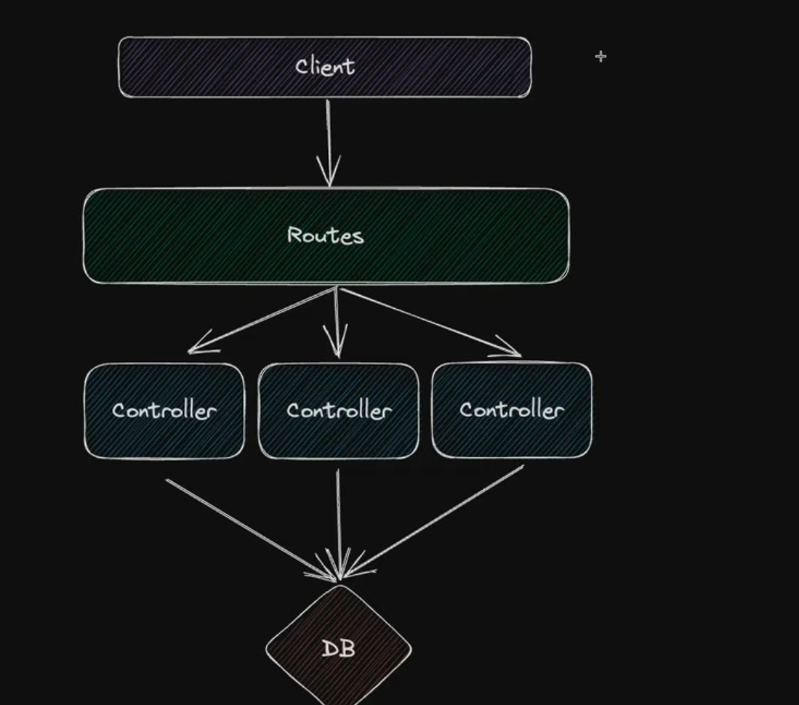
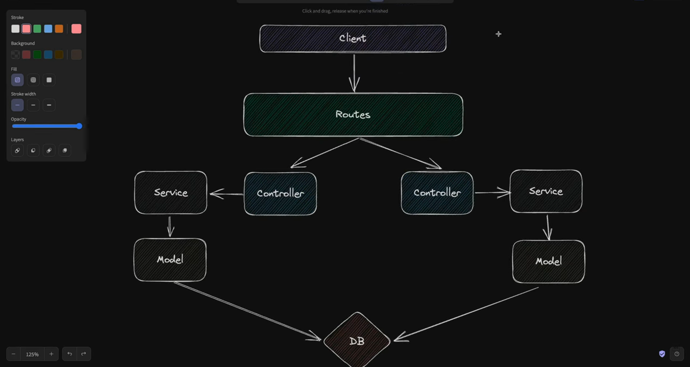

# 3 Layer Architecture 

### Incorrect 
     

- Here the controller is handling the db call which should be done by a service 
- this architecture is not scalable 
- cause if a service inside 1 controller is required by another controller then i have re-create a new instance of it inside it

---

### Correct [https://github.com/gusgad/youtube-tutorials]
  
- Here the controller simply fetch the request and send the response 
- service handles the business logic 
- service will not going to directly communicate with database but through the help of model(data layer)
- the model contains the sql queries 
- this is scalable cause we can define multiple service that can work with multiple controllers .


---

# Logging 
```sh
npm i morgan
```

---
# monitering 
-> sentry