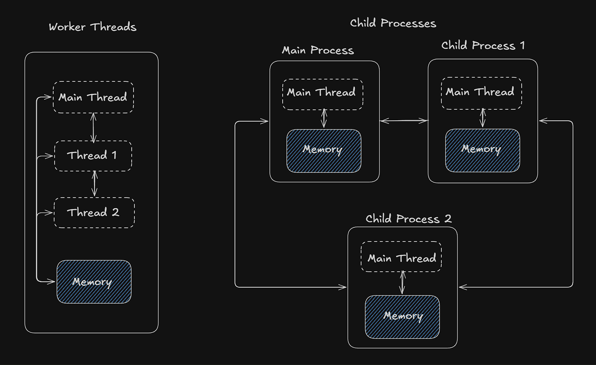
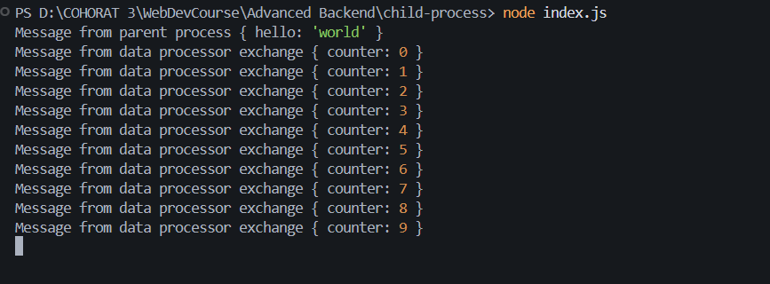

### Child Processes [https://nodejs.org/api/child_process.html#child-process]
* Node.js provides the `child_process` module, which allows you to spawn new child processes from current process.

* These new child process are isolated from each other ,therefore they have their own main thread , memory and resources, and can run independently of the parent process.

* Hence if one child process crashes, it does not affect the other child processes or the parent process.

* OS treats each child process as a separate process .

* These child processes can communicate with each other and with the parent process using inter-process communication (IPC)  provided by Node.js, such as message passing using fork .

**Use Case :** Choose child processes when you need complete isolation or want to utilize external processes. Choose worker threads for parallel computation within a single process.

**Resource Utilization :** Child processes typically have higher resource overhead compared to worker threads due to process creation and management.

**Complexity :** Child processes are simpler to implement and manage compared to worker threads, which require careful handling of shared memory and synchronization.

---

### Difference from `worker_threads` 
  


* **In case of workers threads :**
    * New Threads are created within the same process 
    * These Threads share the same memory and resources with each other and main thread.
    * If one thread crashes, it can affect the other threads and the main thread.

---

### Difference from `clusters`   

#### `child_process` —
- Designed to **run external commands or scripts** as a one-off task.
- eg : run a task in a separate process

```
Main Process
├── spawns → child process (runs a task)
│               └── sends result back via stdout / IPC
│               └── exits when task is done
└── continues doing its own thing
```
---

#### `cluster` —
- Designed to run **multiple instances of the same Node.js server** to handle more requests in parallel.
- eg : scale your HTTP server across CPU cores

```
Master Process
├── spawns → Worker 1 (full copy of server)  ←── handles requests
├── spawns → Worker 2 (full copy of server)  ←── handles requests
├── spawns → Worker 3 (full copy of server)  ←── handles requests
└── spawns → Worker 4 (full copy of server)  ←── handles requests
             │
             └── all share the same PORT via master
```

---

#### The core differences

| | `child_process` | `cluster` |
|---|---|---|
| Purpose | Run a task / external command | Scale a server across CPU cores |
| What it runs | Anything (ffmpeg, python, bash) | Same Node.js file as master |
| Lifetime | Exits when task is done | Kept alive to serve requests |
| Shares port | No | all workers share same port |
| Communication | stdout / stderr / IPC | IPC (master ↔ worker) |
| Load balancing | not built in | built in (round robin) |
| Use case | One-off tasks | Handling concurrent HTTP traffic |

---

#### Memory isolation — both are isolated but differently

```
child_process spawn:
Main Process [50MB]
└── child [separate 50MB]  ← completely separate, shares nothing
                              dies after task completes

cluster:
Master [50MB]
├── Worker 1 [50MB copy]   ← separate memory, same code
├── Worker 2 [50MB copy]   ← separate memory, same code
├── Worker 3 [50MB copy]   ← separate memory, same code
└── Worker 4 [50MB copy]   ← all kept alive, serving requests
```

Both are isolated — but cluster workers are **persistent clones of your server** while child processes are **temporary task runners**.

---


### How to create a child process in Node.js?

*There a Multiple Ways to Create a Child Process*

**1) exec(command,callback) :**
* Spawns a shell then executes the command within that shell, buffering any generated output.
* buffers entire output in memory, gives it to you all at once 
* good for small output (dir listing, git status)
* this did not spin up a new child process cause we are simply executing a command in command line , we are not targeting a node process


```js
import {exec } from "child_process" ;

exec('dir',(error , stdout , stderr) => {
    if(error) {
        console.error(`error : ${error.message}`) ; 
        return ; 
    }

    if(stderr) {
        console.error(`stderr : ${stderr}`) ; 
        return ; 
    }

    console.log(`stdout :\n${stdout}`)
});
```
---

**2) execFile(command,args,callback) :** Use when you want to run a external script and file 


```js
import {exec ,execFile ,spawn ,fork } from "child_process" ;
import path, { dirname } from "path";
import { fileURLToPath } from "url";

const __dirname = dirname(fileURLToPath(import.meta.url)) ;

const fileProcessorPath = path.resolve(__dirname,'execFileProcessor.js') ; // path resolver

// here command is to run this file (node execFileProcessor.js)
execFile('node',[fileProcessorPath],(error, stdout, stderr) =>{
    if(error) {
        console.error(`error : ${error.message}`) ; 
        return ; 
    }

    if(stderr) {
        console.error(`stderr : ${stderr}`) ; 
        return ; 
    }

    console.log(`stdout :\n${stdout}`)
});
```

[execFileProcessor.js](execFileProcessor.js)
```js
console.log('Processing data...') 
let counter = 0 ;
for(let i = 0 ; i<10000000 ; i++) counter++ ;
console.log(`Processing ${counter} entries finished`) ;
```

---

**3) spawn(command,options) :**
* streams daat chunk by chunk via stdout readable stream
* good for large output (find, logs, ffmpeg, video processing)
* event driven (callback are asynchronous since they are pushed into event loops)
* The spawn() method spawns a new process using the given command, with command-line arguments in args. If omitted, args defaults to an empty array.

```js
import { spawn } from "child_process" ;

const spawnedChild = spawn('dir', ['/s', '/b'],  { shell: true }) ;

spawnedChild.stdout.on('data',(data) =>{
    console.log(`stdout :\n${data}`)
    
})

spawnedChild.stderr.on('data',(data) =>{
    console.error(`stderror : ${data}`) ; 
})

spawnedChild.on('error',(error) =>{
    console.error(`error : ${error.message}`) ; 
})

spawnedChild.on('close',(code) =>{
    console.log(`child process exited with code :\n${code}`)
    
})

```
---

**4) fork(modulePath, args, options) :**
*  create a child process that runs a specific module (a JavaScript file) 
*  fork allows the child process to communicate each other

```js
import {fork } from "child_process" ;
import path, { dirname } from "path";
import { fileURLToPath } from "url";

const __dirname = dirname(fileURLToPath(import.meta.url)) ;


const forkProcessorPath = path.resolve(__dirname,'forkProcessor.js') ;
const forkChild = fork(forkProcessorPath) ; 

forkChild.on('message',(msg) =>{
    console.log('Message from data processor exchange',msg) ;
})

// sending message to another child process
forkChild.send({hello : 'world'}) ;
```


[forkProcessor.js](forkProcessor.js)

```js
process.on('message',(msg) =>{
    console.log('Message from parent process',msg) ;
})

let counter = 0 ;
setInterval(() =>{
    process.send({counter : counter++}) ;
},1000) ;
```




**Best Practices**

* use spawn or fork instead of exec and execFile when you expect large output or want to stream data
* Do not invoke child processes based on direct user input
* Do not put user input into child processes 