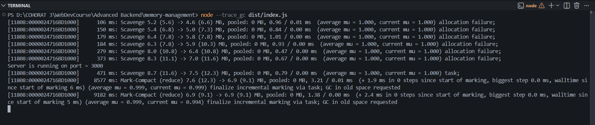
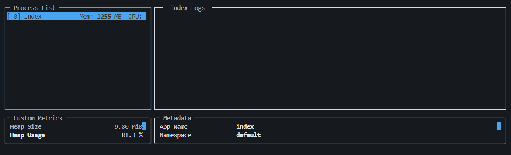
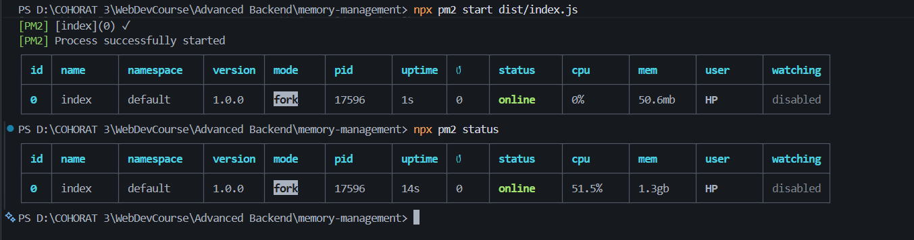

## Garbarge Collector
- The Garbarge Collector in Node.js V8 engine is responsible for finding unreferenced memory variables and freeing up the memory they occupy. 
- It uses a [`mark-and-sweep algorithm`](https://www.geeksforgeeks.org/java/mark-and-sweep-garbage-collection-algorithm/) to identify unreferenced memory and clean up memory that is no longer in use, helping to prevent memory leaks and optimize performance. 

- The main disadvantage of the `mark-and-sweep approach` is the fact that  `normal program execution is suspended` while the garbage collection algorithm runs.

---

## Memory Leaks in Node.js
- Sometime the Garbarge Collector is not able to free up memory that is no longer in use, which can lead to memory leaks.

    ### Cases of Memory Leaks in Node.js 
    ---
    - **Uncleared Timers / Intervals** 

    - **Global Variables** 
        * causes memory leaks because they are attached at the root level (window in browser and global in Node.js) and will not be garbage collected until the application is terminated
        
        *  the GC does not know whether the variable is needed or not because they are attached to the root.

    - **Self-referencing Objects**
        * Objects that reference themselves can create memory leaks if not handled properly, as they may prevent the garbage collector from freeing up memory.

        * Garbage collector in Node js is smart enough to handle cyclic references 

            ```ts
                const obj = { name: 'Node.js' }
                obj.badObject = obj
            ```

    - **Closures** 
    - **Unreferenced Nodes in Browers** : Removed DOM nodes stuck as references .

    ---

    `Example` : [index.ts](../src/index.ts)

    ```ts
    import express, { type Request, type Response } from "express" ; 
    import EventEmitter from "events" ;
    const eventEmitter = new EventEmitter() ;

    const port = 3000 ; 
    const app = express() ;

    /*
    Global variable 
        -> causes memory leaks because it is attached at the root level (window in browser and global in Node.js) 
        and will not be garbage collected until the application is terminated
        -> the GC does not know whether the variable is needed or not because they are attached to the root.
        -> if more than one route access this task array (Global variable) then the memory will get stuck for sure
    */
    let tasks = [] ; 


    app.get("/" , (req : Request , res : Response) => {
        /*
            closures with an external variable (tasks) reference
                -> callbacks are ambigious for the GC 
                -> because GC do not know whether the callback is finished or not .
        */
        tasks.push(function(){
            return req.headers ;
        })


        /* 
            too much data 
                -> use some in memory cache such as node-cache or memcached or redis to store the data instead of keeping it in memory

        */
        const hugeArray = new Array(1000000000).fill(req) ;


        /*
        Self referencing object (cycic references)
            -> Garbage collector in Node js is smart enough to handle cyclic references 
        */
    
        req.body.user = {
            id : 1 ,
            name : "John Doe",
            hugeArray 
        }

        req.body.badObject = req ; // self referencing object (cyclic reference)

        

        const onStart = () => { console.log("Event emitted") }

        // works like eventListener and will be called when the event is emitted
        eventEmitter.on('start', onStart)

        // if you don't remove emitter listener it will get stuck in the memory
        // eventEmitter.removeListener('start', onStart)

        // Timeout : if you set a timeout and never clear it on cleanup, it leaks memory
        const reswithTimeOut = setTimeout(() =>{
            res.send("Hello World") ;
        },3000) 

        // if you don't clear the timeout it will get stuck in the memory
        // clearTimeout(reswithTimeOut) ;

    }) ;

    app.listen(port , () => {
        console.log(`Server is running on port = ${port}`) ;
    })

    ```
    
    ---

    ### To Visulize Memory Leaks in Node.js

    * first compile the code 
    ```
        npm run build
    ```

    * then run the code with the `--trace_gc` flag to see the garbage collection traces in the console.
    ```
        node --trace_gc dist/index.js
    ```

    **Output** :

    
    

    * install `autocannon` to run a stress test on the server 
    ```
        npm install autocannon
    ```

    * run the stress test using `autocannon` : **sending 200 concurrent requests for 60 seconds to the server to see the memory usage and garbage collection traces in the console.**
    ```
        npx autocannon -c 200 -d 60 http://localhost:3000
    ```
    *run this command in a separate terminal while the server is running*

    
    * inspecting the memory in the browser

    ```
        node --inspect dist/index.js
    ```

    *  To inspect the memory in the browser open 
    ```
        chrome://inspect
    ``` 

    ---

    ### Inspecting Memory Leaks using `pm2`
    
    * install pm2 
    ```
        npm install pm2
    ```

    * start the application with pm2 
    ```
        npx pm2 start dist/index.js 
    ```

    * getting the memory logs 
    ```
        npx pm2 log
    ```

    * run the stress test using `autocannon` 
    ```
        npx autocannon -c 200 -d 60 http://localhost:3000
    ```
    *run this command in a separate terminal while the server is running using pm2*

    * To get more details about the memory usage you can use the `pm2 monit` command to see the memory usage in real time.
    ```
        npx pm2 monit
    ```

    

    