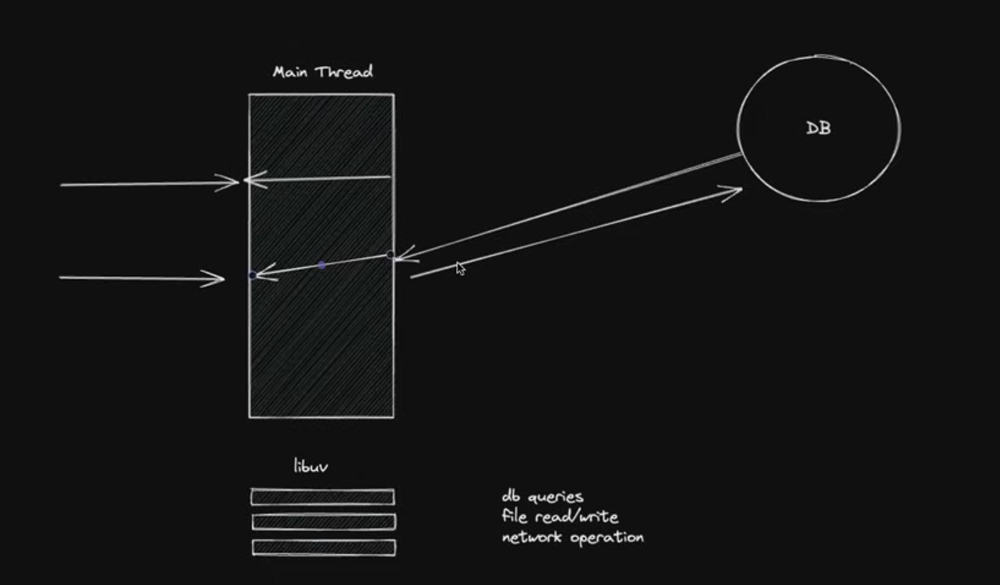

# Without Multi-Threading 

 * All Load on the Main thread
 * JavaScript is single threaded language but Node.js uses V8 engine and 
 * The V8 engine uses libuv library that lets node application 
   to create some extra hidden threads : 

*  Asynchronus Nature emits -> 

    Total : 7 Threads (1 Main thread + 2 Threads for Garbage Collector + 4 Extra when needed)
    4 Extra Threads reponds when there is  I/0 operators , db call , file read/write , network data transmission
    
    `that's why node is asynchronous`  
     


normal.ts 
---------
* when blocking page is opening , then the request to non-blocking page also gets blocked 
  due to main threading being occupied with blocking page request .

```ts
import Express, { type Request, type Response }  from 'express' ;
import cors from "cors"

const app = Express() ;
app.use(cors()) ;

app.get("/non-blocking",(req : Request , res : Response) =>{
    res.status(200).send("unblocked page") ;
}) ;

app.get("/blocking",(req : Request, res : Response) =>{
    let counter = 0 ; 
    for(let i = 0 ; i<20_000_000_000 ; i++){
        counter ++ ;
    }
    res.status(200).send(`result is ${counter}`) ; 
}) ;

app.listen(3000) ; 
```

# With Multi-Threading
[https://www.digitalocean.com/community/tutorials/how-to-use-multithreading-in-node-js]

* Done for CPU intensive tasks
* First Create a worker thread

* For a single CPU-intensive Node.js process, `worker_threads` creates multiple threads within the same process. 
* These threads share memory and the OS schedules them across cores, 
* dividing heavy work efficiently without spawning separate processes.

* about `worker_threads` library : [https://nodejs.org/api/worker_threads.html]

```
Single Node.js Process
├── Main Thread (event loop)
├── Worker Thread 1 (CPU task)
└── Worker Thread 2 (CPU task)
```

worker.ts
---------
```ts
import { parentPort } from 'worker_threads' ;

let counter = 0 ; 
for(let i = 0 ; i<20_000_000_000 ; i++){
    counter ++ ;
}

// postMessage is the way to communicate with the main thread from worker or different thread
parentPort?.postMessage(counter) ; 

```

* Use that worker in the server

multi-threading.ts
-------------------
now when blocking page is opening , then the request to non-blocking page 
does not get blocked since blocking page request is being handled by worker not the main thread .
the main handles the non-blocking page request .

```ts
import Express, { type Request, type Response }  from 'express' ;
import cors from "cors"
import { Worker } from 'worker_threads';

const app = Express() ;
app.use(cors()) ;

app.get("/non-blocking",(req : Request , res : Response) =>{
    res.status(200).send("unblocked page") ;
}) ;

app.get("/blocking",(req : Request, res : Response) =>{
    const worker = new Worker("./dist/worker.js") ; // url of the created worker

    worker.on("message",(data) =>{ // data from the worker
        res.status(200).send(`result is ${data}`)
    })

    worker.on("error",(err) =>{
        res.status(404).send(`error occured : ${err}`)
    })

}) ;

app.listen(3000) ; 
```

# To Further Optimize 

* Find how many cores do you have ? 

`In Windows`

```cmd
wmic cpu get NumberOfCores, NumberOfLogicalProcessors
<!-- ``` -->

output
------
NumberOfCores  NumberOfLogicalProcessors  
6              12                         
```


4 workers.ts (Lets use 4 workers )
------------
```ts
import { workerData , parentPort } from 'worker_threads' ;

let counter = 0 ; 

// the number of worker parameter comes from main thread 
// here 4 workers will do 5_000_000_000 iterations each and send it to main thread
for(let i = 0 ; i<20_000_000_000 / workerData.thread_count ; i++){
    counter ++ ;
}

// postMessage is the way to communicate with the main thread from worker or different thread
parentPort?.postMessage(counter) ; 

```

4-cores-multi-threading.ts
--------------------------
```ts
import Express, { type Request, type Response }  from 'express' ;
import cors from "cors"
import { Worker } from 'worker_threads';

const app = Express() ;
const THREAD_COUNT = 4 ;  // Using 4 Cores

function createWorker(){
    return new Promise((resolve,reject) =>{
        const worker = new Worker("./dist/4-workers.js",{
            workerData : {thread_count : THREAD_COUNT}
        }) ; 

        worker.on("message",(data) =>{
            resolve(data) ; 
        })

        worker.on("error",(err) =>{
            reject(`error occured : ${err}`)
        })
    })
}

app.use(cors()) ;

app.get("/non-blocking",(req : Request , res : Response) =>{
    res.status(200).send("unblocked page") ;
}) ;

app.get("/blocking",async(req : Request, res : Response) =>{
    const workerPromises = [] ; // array of worker promises
   
    for(let i = 0 ; i<THREAD_COUNT ; i++){
        workerPromises.push(createWorker()) ;
    }

    const thread_results : any[] = await Promise.all(workerPromises) ; 
    const total = 
        thread_results[0] +  // 5_000_000_000
        thread_results[1] +  // 5_000_000_000
        thread_results[2] +  // 5_000_000_000
        thread_results[3] ;  // 5_000_000_000

    res.status(200).send(`result is ${total}`)
}) ;

app.listen(3000) ; 
```