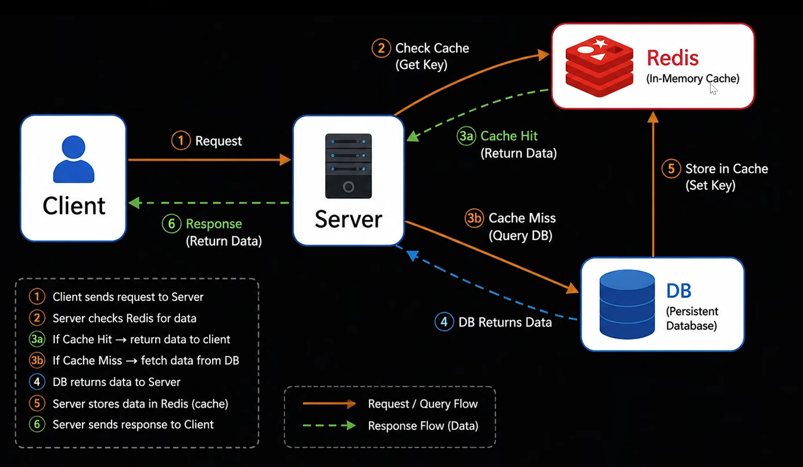

### Redis 
- **In memory `key value` based `database` (uses primary memory to store data, which allows for faster access compared to traditional disk-based databases)**  
        



---

### Installing `redis` using docker 

[docker-compose.yml](../docker-compose.yml)
```yml
services : 
  redis : 
    image : redis  # redis image to download
    ports :
      # port mapping redis container port to our machine port to be able to use redis in local system
      - 6379:6379   # redis port is 6379
```

--- 

* open the docker desktop to run the docker container

### To Run the Docker Compose file (`docker-compose.yml`)

```   
    docker compose up
```

*This will install the `redis image` inside it and run the `redis container`*

---

### Applications of Redis 
- API caching   (caching data from API)
- OTP Storage   (temporary OTP)
- Session management  (login)
- Rate limiting (API protection)
- Queues    
- AI Memory (chatbot history)


**Click  -> [`Applications`](../applications)**
