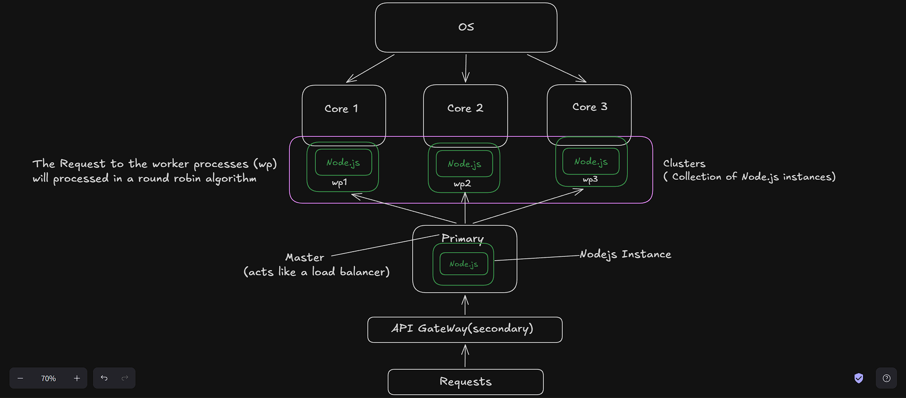
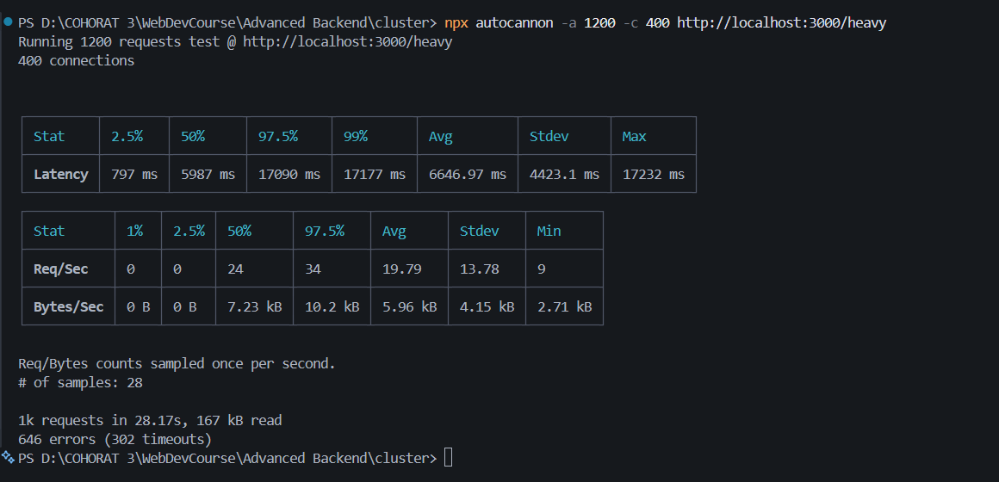
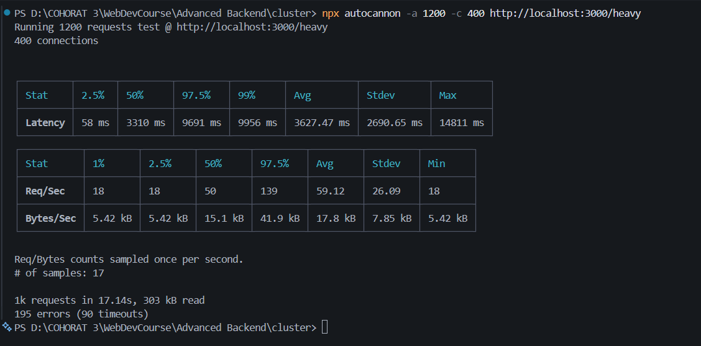
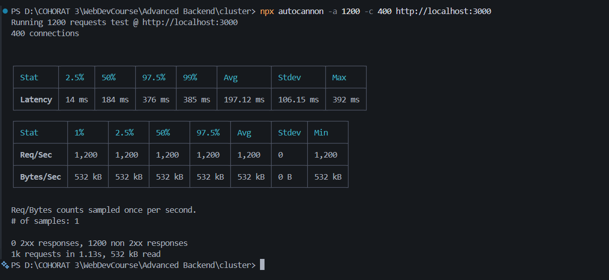

## Cluster [https://www.digitalocean.com/community/tutorials/how-to-scale-node-js-applications-with-clustering]


* clustering creates multiple instances of node.js (`worker processes`) that run on OS assigned CPU Cores . 
* Each `worker process` is a full, independent Node.js instance
* the incomming requests are distributed among the worker processes (instances),thus improving the performance of the application.
* only `1 worker` will work at a `single core` at a time  
* therefore multiple workers are working on seprate cores at the same time .
* used in smaller project as a load balancer and used in place of docker and container creation .

* [https://nodejs.org/api/cluster.html]
   Clusters of Node.js processes can be used to run multiple 
   instances of Node.js that can distribute workloads among their
   application threads. When process isolation is not needed, use
   the worker_threads module instead, which allows running multiple application threads within a single Node.js instance.

    ---
    ## How It Works

        Incoming Requests
                ↓
        Master Process (port owner) (port 3000)
        (Load Balancer)
        ↙    ↓    ↘
        W1     W2     W3    ← Worker Processes (each a full Node.js instance)

    The master process distributes incoming requests across workers — by default Node.js uses a **round-robin** strategy:

    ```
    Request 1  →  Worker 1
    Request 2  →  Worker 2
    Request 3  →  Worker 3
    Request 4  →  Worker 1  (back to start)
    ...
    ```

    ---
    ### Why This Helps

    Without clustering, a single Node.js process handles **all requests alone** on one core, leaving your other 11 logical processors idle.

    With clustering (12 workers on your machine):
    - All 12 logical processors are utilized
    - Requests are spread across 12 workers
    - If one worker crashes, others **keep serving requests**


    ---
    ### One Key Detail

    All workers **share the same port** (e.g. `3000`) — the master process owns the port and hands off connections to workers. From the client's perspective, it's just one server.


    ---
    ### How to use Clustering ? 
    ---
    ### Method 1 (using cluster module)
    * importing `cluster` module 
    ```js
    import cluster from 'node:cluster' ; 
    ```

    * creating master process (instance) 
    ```js
        cluster.setupPrimary({
            exec : __dirname + "/index.js" 
        }) ;
    ```

    * creating instances of node js (worker processes) 
    ```js
        cluster.fork() ;
    ```

    **`cluster.ts`**

    ```ts
    import cluster from 'node:cluster' ; 
    import os from 'node:os' ;
    import { dirname } from 'path';
    import { fileURLToPath } from 'url';

    const  __dirname = dirname(fileURLToPath(import.meta.url)) ;

    const cpuCount = os.cpus().length ;

    console.log(`Total number of CPUs is ${cpuCount}`) ;
    console.log(`Primary pid = ${process.pid}`) ;

    // setting up the cluster 

    // creating master process (instance) that will listen to the port and distribute the requests to the worker processes (instances)
    cluster.setupPrimary({
        exec : __dirname + "/index.js" 
    }) ;

    // creating instances of node js as many as cpu cores 
    for(let i = 1 ; i <= cpuCount ; i++){
        cluster.fork() ;  // creates worker process (node js instances)
    }

    // when instance is crashed or killed 
    cluster.on("exit",(worker , code , signal) =>{
        console.log(`worker ${worker.process.pid} has been killed`) ; 
        console.log('Starting another worker') ; 
        cluster.fork() ; 
    })
    ```

    output
    ```
    Total number of CPUs is 12
    Primary pid = 9972
    Server is running on port 3000
    worker pid = 13824
    Server is running on port 3000
    worker pid = 17388
    Server is running on port 3000
    worker pid = 6204
    Server is running on port 3000
    worker pid = 15872
    Server is running on port 3000
    worker pid = 8848
    Server is running on port 3000
    worker pid = 3896
    Server is running on port 3000
    worker pid = 1608
    Server is running on port 3000
    worker pid = 14644
    Server is running on port 3000
    Server is running on port 3000
    worker pid = 4908
    worker pid = 16608
    Server is running on port 3000
    worker pid = 16348
    Server is running on port 3000
    worker pid = 13800
    ```

    ---
    ### Method 2 (using pm2 module) 
    
    [pm2 and autocannon](pm2-autocannon.md)


    * pm2 handles everything automatically (`clustering / monitering`) and has `zero downtime reload`.

    * install pm2 
    ```
        npm i pm2 
    ```

    * run pm2 (**No need to run cluster.ts**)
    ```
    npx pm2 start dist/index.js -i max
    ```


    ### Comparison 
    Note : autocannon is used to generate HTTP requests to test the performance of the server.

    * **`Without Cluster`**
        
        Terminal 1
        ```
           npm run dev:index
        ```

        Terminal 2
        ```
           npx autocannon -a 1200 -c 400 http://localhost:3000/heavy
        ```

        
        
    * **`With Cluster`**
        
        Terminal 1
        ```
           npm run dev:cluster
        ```
        
        Terminal 2
        ```
           npx autocannon -a 1200 -c 400 http://localhost:3000/heavy
        ``` 

        

    * **`With pm2`**
        
        Terminal 1
        ```
           pm2 start dist/index.js -i max
        ```
            
        `-i max` means to use as many CPU core as there are present (auto-detect).

        Terminal 2
        ```
           npx autocannon -a 1200 -c 400 http://localhost:3000/heavy
        ```      
        
        

    **pm2 provides the fastest response time and the highest throughput** because it is optimized for production environments and handles clustering, load balancing, and monitoring efficiently.   

---
## Multi-threading

* For a single CPU-intensive Node.js process, `worker_threads` creates multiple threads within the same process. 
* These threads share memory and the OS schedules them across cores, 
* dividing heavy work efficiently without spawning separate processes.

```
Single Node.js Process
├── Main Thread (event loop)
├── Worker Thread 1 (CPU task)
└── Worker Thread 2 (CPU task)
```

### Difference between `cluster` and `worker_threads`

|             | Clustering             | Worker Threads     |
|-------------|------------------------|--------------------|  
| **Unit**    | Process                | Thread             |
| **Memory**  | Isolated               | Shared             |
| **Use case**| Scale I/O across cores | CPU-intensive tasks|
| **Module**  | `cluster`              | `worker_threads`   |
| **Overhead**| Higher (full process)  | Lower              |

---