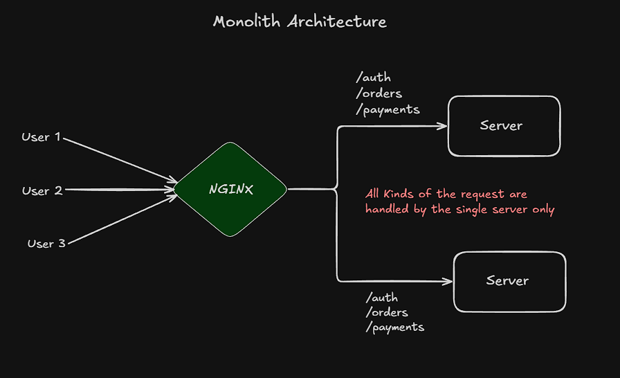
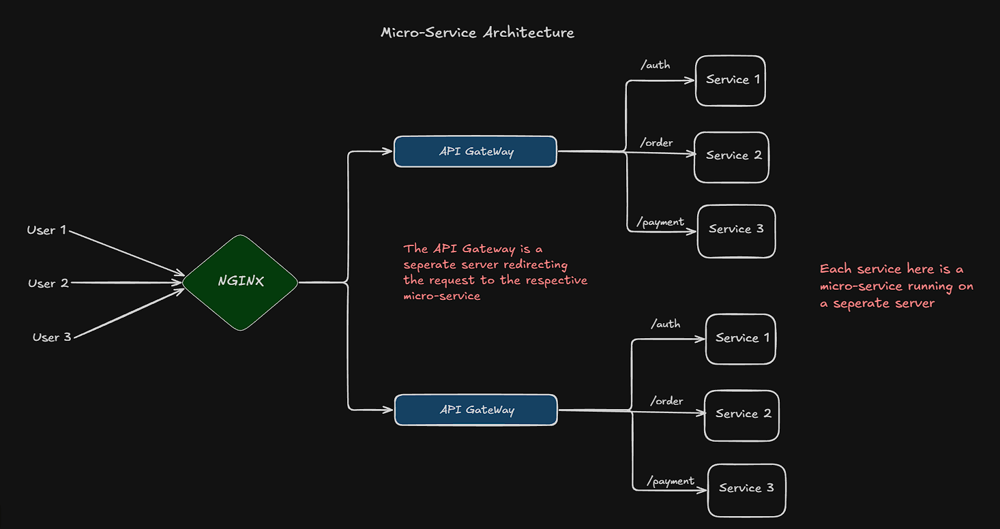
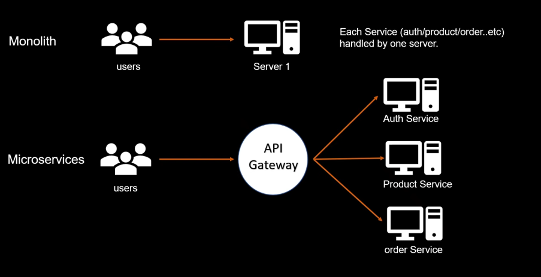

### Monolithic Architecture
- In monolithic architecture ,the application is tightly bundled together
- an server is responsible for handling all kind of requests and processing them .  
- To add a service , we need to change the code of the server and redeploy it .    

    

---

### Micro-Service Architecture 
- In micro-service architecture , the application is divided into small independent services
- here, an server acts an `API Gateway` which is responsible for routing the request to the appropriate micro-service (server) .  

- The services are independent and can be developed, added and scaled independently.

    

---

### Without Load Balancer (Micro-Service vs Monolithic Architecture )



---

### Micro-Service Architecture Structure
- [App](app) : contains the Folder and File Structure of the Application
    - Each [Service](app/backend/services) will be a seperate `Node.js application` cause they are seperate server  

        - [auth](app/backend/services/auth) 
        - [order](app/backend/services/order) 
        - [payment](app/backend/services/payment)  
  
    - [GateWay](app/backend/gateway) : `API Gateway` which will route the request to the appropriate service.  

        **How to make `API Gateway` in `Express` ?**
        - Package to implement `API Gateway` is `express-http-proxy`
            ```
            npm install express-http-proxy
            ```
        - The `GateWay` port will contain the main port (port that will be passed to `Ngnix`)

        -  `Gateway` made using the middlware
        -  syntax

            ```js
                import proxy from 'express-http-proxy';
                app.use(route,proxy(service-url)) ;
            ```

        ---
        ### Implementing Micro-Service Architecture (Without Load Balancing)

        -   [index.js](app/backend/gateway/index.js) : Running outside Docker Container

            ```js
                import express from 'express'
                import dotenv from 'dotenv' 
                import proxy from 'express-http-proxy';
                dotenv.config() ; 

                const port = process.env.PORT || 5000 

                const app = express() ; 

                app.use(express.json()) ;

                // Running outside Docker Container

                // auth service : running at port 8001
                app.use("/auth",proxy("http://localhost:8001")) ; 

                // order service : running at port 8002
                app.use("/order",proxy("http://localhost:8002")) ; 

                // payment service : running at port 8003
                app.use("/payment",proxy("http://localhost:8003")) ; 

                app.get("/",(req,res) => {
                    return res.status(200).json({message : `hello from api gateway`}) ;
                })

                app.listen(port ,async() => {
                    console.log(`server started at port ${port}`) ; 
                }) 
                ```
        
        - Run this command inside the `GateWay` server and `services` seprately inside their directory in seprate terminal to start the server and services
            ```
            node index.js
            ```


        ### Implementing Micro-Service Architecture (Load Balancing)

        * [docker-compose.yml](app/docker-compose.yml) :   
           
            ```yml
                services:
                nginx : 
                    image : nginx 
                    ports:
                    - 8080:80    # hostport:containerport
                    volumes:
                    -  ./nginx/nginx.conf:/etc/nginx/nginx.conf  # hostfilepath:containerfilepath

                gateway1 : 
                    build : ./backend/gateway
                    env_file : 
                    - ./backend/gateway/.env
                    environment : 
                    - SERVER_NAME=gateway 1
                    ports  : 
                    - 7001:8000

                gateway2 : 
                    build : ./backend/gateway
                    env_file : 
                    - ./backend/gateway/.env
                    environment : 
                    - SERVER_NAME=gateway 2
                    ports  : 
                    - 7002:8000

                auth-service : 
                    build : ./backend/services/auth
                    env_file : 
                    - ./backend/services/auth/.env
                    ports  : 
                    - 5001:8001

                order-service : 
                    build : ./backend/services/order
                    env_file : 
                    - ./backend/services/order/.env
                    ports  : 
                    - 5002:8002

                payment-service : 
                    build : ./backend/services/payment
                    env_file : 
                    - ./backend/services/payment/.env
                    ports  : 
                    - 5003:8003
            ```  
        
        * [nginx.conf](app/nginx/nginx.conf)  

            ```conf
                events{

                }

                http{
                    upstream backend {
                        server gateway1:8000 ;
                        server gateway2:8000 ;
                    }

                    server {
                        listen 80 ;
                        location / {
                            proxy_pass http://backend ;
                        }
                    }
                }
            ```  

        * [index.js](/app/backend/gateway/index.js) : Running inside Docker Container

            ```js
                import express from 'express'
                import dotenv from 'dotenv' 
                import proxy from 'express-http-proxy';
                dotenv.config() ; 

                const port = process.env.PORT || 5000 

                const app = express() ; 

                app.use(express.json()) ;


                /* Running inside Docker Container */

                // auth service : running at auth-service container port 8001
                app.use("/auth",proxy("http://auth-service:8001")) ; 

                // order service : running at order-service container port 8002
                app.use("/order",proxy("http://order-service:8002")) ; 

                // payment service : running at payment-service container port 8003
                app.use("/payment",proxy("http://payment-service:8003")) ; 


                app.get("/",(req,res) => {
                    return res.status(200).json({message : `hello from ${process.env.SERVER_NAME}`}) ;
                })


                app.listen(port ,async() => {
                    console.log(`server started at port ${port}`) ; 
                }) 
            ```