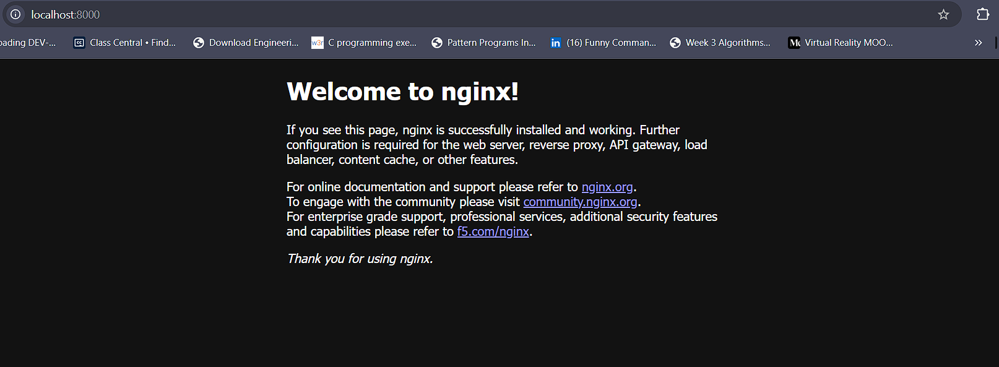
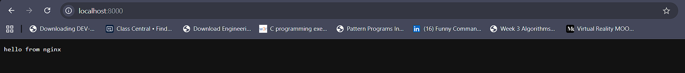
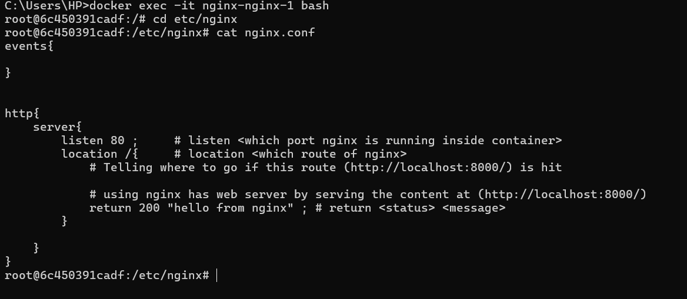
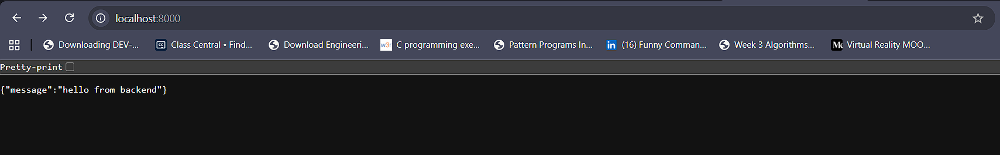
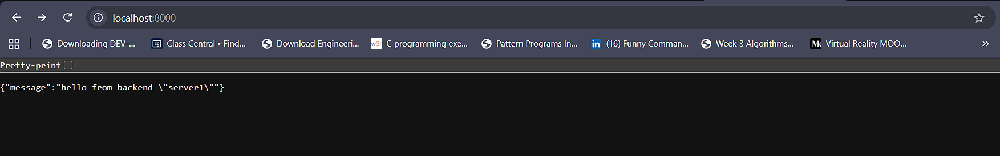
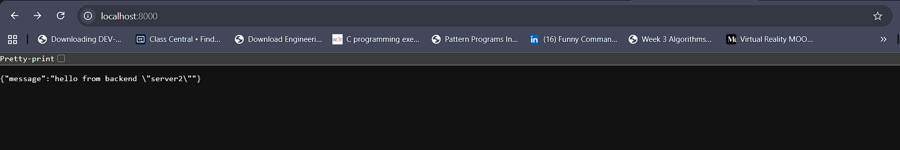
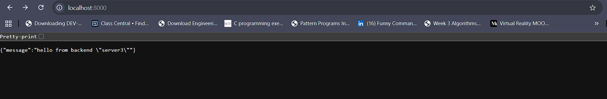

### Ngnix 
- Nginx is a software that provides 
    - `reverse proxy` (allows to internally map multiple ports to a single port) 
    - `load balancering` (distributing traffic among the servers) 
    - `SSL` 
    - `routing`

---
### Running Nginx using Docker
---

* [docker-compose.yml](docker-compose.yml)  

    ```yml
    services :
        nginx :   # creating nginx container 
            image : nginx  # Pull nginx image from docker hub
            ports: 
            - 8000:80    # system-port:container-port ,nginx runs on port 80 inside the container
    ```

    ---

* To run the docker file and run the  container   

    ```sh
    docker compose up 
    ```

    ---  

*   Go to port 8000 of your machine **[http://localhost:8000/](http://localhost:8000/)**  
    you will see nginx running as a web server : 

    

---

### Going the nginx container 

* Open Command Prompt and run 

    ```sh
    docker exec -it <container-name> bash
    ```

    here 

    ```sh
    docker exec -it nginx-nginx-1 bash
    ```

* to see the files 
    ```sh
        ls
    ```

* to configure and map the servers (sending user to which server ?)

    * go to nginx directory :

    ```sh 
        cd etc
        cd nginx
        ls
    ```

    * after doing `ls` and you will see `nginx.conf` file .
    * This `nginx.conf` is the configuration file in which we will tell which request which go to which server

    * to see the file content : 

        ```
        cat nginx.conf
        ```

        * **NOTE** : The content inside `nginx.conf` file is displayed on (http://localhost:8000/)

        

    * to edit or delete the `nginx.conf` file : 
        * There are two ways to edit the file :
            1. using `vi` editor 
            2. In `docker volumes` (used to store data permanently outside containers so data remains safe if containers are deleted or restarted) using `Bind Mounts` (mapping the **container folder** to our **local system folder** and edit it using any editor in our system ,and the changes are `synchronized`(at real time) **i.e** `if one file changes then same changes are reflected on the other file`) :

                ```sh
                docker run -it -v <local-path>:<container-path> <image-name> bash
                ```

                * writing volume inside `docker-compose.yml` file : 

                    **hostpath (`path of file in local system` ) = ./nginx/nginx.conf**  
                    **containerpath (`path of file inside container`)= /etc/nginx/nginx.conf**

                    ```yml
                    services :
                    nginx :            # creating nginx container 
                        image : nginx  # Pull nginx image from docker hub
                        ports: 
                        - 8000:80      # system-port:container-port , nginx runs on port 80 inside the container
                        volumes:
                        - ./nginx/nginx.conf:/etc/nginx/nginx.conf   # hostpath:containerpath
                    ```
---  

### Configuring `nginx.conf` file

* Boiler Plate

    ```conf
    events{

    }

    http{
        server{
            listen 80 ;     # listen <which port nginx is running inside container>
            location /{     # location <which route of nginx>
                # Telling where to go if this route (http://localhost:8000/) is hit

            }

        }
    }
    ```

* using nginx has a `web server`

    ```conf
    events{

    }

    http{
        server{
            listen : 80 ;
            location /{    
                # using nginx has web server by serving the content at (http://localhost:8000/)
                return 200 "hello from nginx" ;  # return <status> <message>
            }

        }
    }
    ```

    * Stop the container : `Ctrl + C`
    * Remove the container 
        ```sh
            docker compose down
        ```
    * Restart the container 
        ```sh
            docker compose up --build
        ```

    * **Now the (http://localhost:8000/) serves the new content :**  

        

    * **The content inside the container (root@6c450391cadf:/etc/nginx#) has also changed**  

        


* to reload the content inside (http://localhost:8000) through the container 
    ```sh
    nginx -s reload
    ```


--- 

### Creating a Server by running Image of a Server inside the containers

* [**server**](server) : i have copied the redis [application](../../redis/applications/)  server here and changed the server port to 7000 

* no need to do `npm install` to install node_modules , the `DockerFile` will do that automatically inside the container

* create [**Dockerfile**](server/Dockerfile) inside the server that will be running inside the container 

    ```DockerFile
    FROM node

    WORKDIR /app

    COPY package*.json .
    RUN npm install
    COPY . .

    CMD [ "node","index.js" ]
    ```

* Creating the container running server using `docker-compose.yml` file

```yml
services :
    nginx :            # creating nginx container 
      image : nginx  # Pull nginx image from docker hub
      ports: 
        - 8000:80    # system-port:container-port , nginx runs on port 80 inside the container
      volumes:
        - ./nginx/nginx.conf:/etc/nginx/nginx.conf   # hostpath:containerpath

    # create container to run to our server by passing backend server image to it .
    server1:
      build : ./server   # build : will run that image that will be builded when the DockerFile runs # no need to seprately publish image in dockerhub
      env_file :         # Passing the enviroment file to the container
        - ./server/.env          
      ports : 
        - 5000:7000      # hostport:containerport
```


### Using Ngnix as a `Load Balancer`

[nginx.conf](nginx/nginx.conf)

```conf

events{

}


http{
    server{
        listen 80 ; 
        location /{   
            # using nginx as a loadbalancer
                proxy_pass http://server1:7000   # proxy_pass http://<container-name>:<container-port> 
        }
    }
}

```  

* do `docker compose down` and then `docker compose up --build` to run the container , the content served on the docker container `server1` port 7000 "/" route will be shown on (http://localhost:8000/) because we have configured nginx as a load balancer and mapped the server1 container to nginx container using `proxy_pass` in `nginx.conf` file

    

  
---

### Making Mutiple Servers and Load Balancing between them

[docker-compose.yml](docker-compose.yml)  

```yml
services :
    nginx :            # creating nginx container 
      image : nginx  # Pull nginx image from docker hub
      ports: 
        - 8000:80    # system-port:container-port , nginx runs on port 80 inside the container
      volumes:
        - ./nginx/nginx.conf:/etc/nginx/nginx.conf   # hostpath:containerpath

    # create container to run to our server by passing backend server image to it .
    server1:
      build : ./server   # build : will run that image that will be builded when the DockerFile runs # no need to seprately publish image in dockerhub
      env_file :         # Passing the enviroment file to the container
        - ./server/.env  
      environment : 
        - SERVER_NAME="server1"   # we can also pass enviroment variable like this
      ports : 
        - 5000:7000      # hostport:containerport

    server2:
      build : ./server   # build : will run that image that will be builded when the DockerFile runs # no need to seprately publish image in dockerhub
      env_file :         # Passing the enviroment file to the container
        - ./server/.env         
      environment : 
        - SERVER_NAME="server2"   # we can also pass enviroment variable like this
      ports : 
        - 5001:7000      # hostport:containerport

    server3:
      build : ./server   # build : will run that image that will be builded when the DockerFile runs # no need to seprately publish image in dockerhub
      env_file :         # Passing the enviroment file to the container
        - ./server/.env          
      environment : 
        - SERVER_NAME="server3"   # we can also pass enviroment variable like this
      ports : 
        - 5002:7000      # hostport:containerport
```

### Loading Balancing b/w `3 Servers` in `nginx.conf` file

[nginx.conf](nginx/nginx.conf)

```conf
events{

}


http{

    upstream backend {  # upstream <variable_name>  
        server server1:7000 ;    #  server <container-name>:<container-port>
        server server2:7000 ;
        server server3:7000 ;
    }

    server{
        listen 80 ;
        location /{
            # mapping servers with loadbalancer using variable name (backend)
            proxy_pass http://backend ;
        }
    }
}
```


* changing `/` route in `index.js` to know the server is serving the content on (http://localhost:8000/)

[index.js](server/index.js)
```js
app.get("/",(req,res) => {
    return res.status(200).json({message : `hello from backend ${process.env.SERVER_NAME}`})
})
```

* do `docker compose down` and then `docker compose up --build` to run the container and go to (http://localhost:8000/) and you will see the content is served from different servers because of load balancing 

* The Requests are assigned to the server in `Round Robin Fashion`

    * **Request 1**   
        

    * **Request 2**   
        

    * **Request 3**   
            

---

### Testing the Load Balancer 

* We will use `autocannon` module to test the load balancer and see how many requests are served by each server  

    ```sh
    npm i autocannon
    ```

* Testing 
 
    ```sh
        npx autocannon -c <number-of-concurrent-user> -d <duration-of-requests> <route-of-server-to-test>
    ```

    here 

    ```sh
        npx autocannon -c 100 -d 10 http://localhost:8000/
    ```