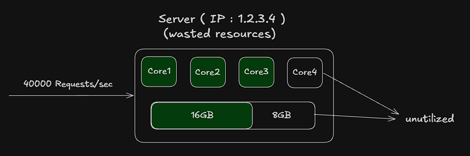
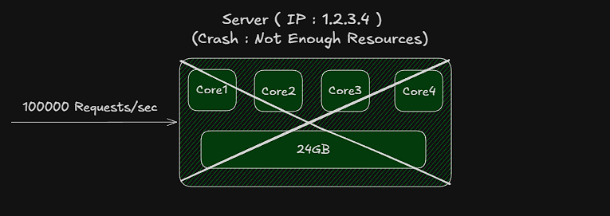
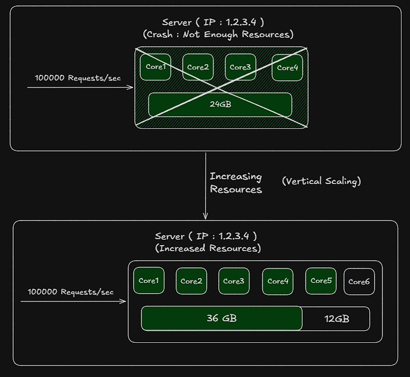
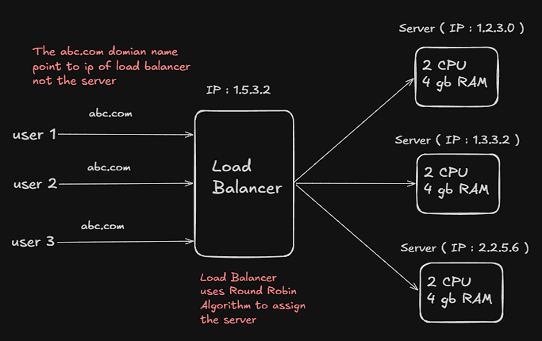

### Scaling 
Scaling is the process of increasing or decreasing the resources of a system to handle more users and traffic.

---

### Vertical Scaling 
 In case of vertical scaling ,`the memory(RAM)` and `CPU Cores` of the `server` (a single machine) are increased to according to the requirement of the application. 

- **Drawback :**
    - If the traffic is low then the resources are not fully utilized 

          

    - If the traffic is high then the server `crashes` cause the resources are not sufficient to handle the traffic and the `downtime` of the server increases. 

        

        **Therefore we increase the resources assigned to the server to handle the traffic , this is called `vertical scaling` .**
            
        
    - The `cost` increases with increase in memory and CPU cores.

---

### Horizontal Scaling 
In case of horizontal scaling , there are multiple servers (machines) with fixed resources . The incomming traffic is distributed among the servers using a `load balancer` .

- **Advantages :**
    - Load on each server is reduced as the traffic is distributed among multiple servers.
    - If more server are required then we can spin up new servers and add them to the load balancer to handle the traffic.
    - If one server crashes then the traffic can be handled by other servers and there is no downtime.

- **Drawback :**
    - The scaling cost is high as we need to maintain multiple servers and load balancer.
    

### Loading Balancer 
- Distributes the incoming traffic among multiple backend servers to handle the traffic and reduce the load on each server.

    * Technologies used for load balancing : 
        * **[Nginx](../nginx/)** (Software)
        * AWS Elastic Load Balancer (Cloud Service)